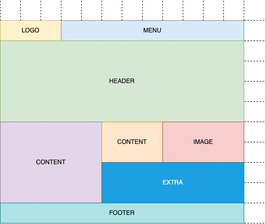

# Grid homework

Используя grid создайте лэйаут согласно макету:

**Количество колонок:** 12 (каждая `1fr`)
**Количество строк:** 10 (каждая `120px`)

*Пунктирными линиями обозначена сетка для удобства (их верстать не нужно)*
