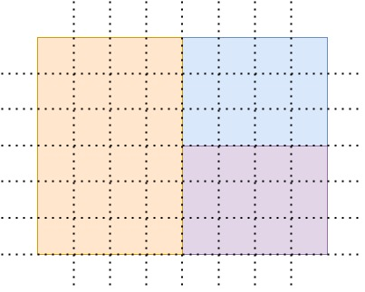
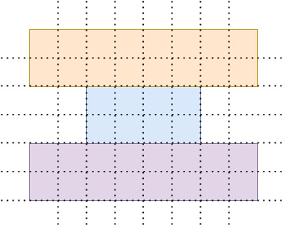

# Media queries homework

Используя grid и медиазапросы создайте блоки как показано на изображениях:

На экране `>1000px`

На экране `<1000px`

**Количество колонок:** 8 (каждая `1fr`)
**Количество строк:** 6 (каждая `120px`)

*Пунктирными линиями обозначена сетка для удобства (их верстать не нужно)*

